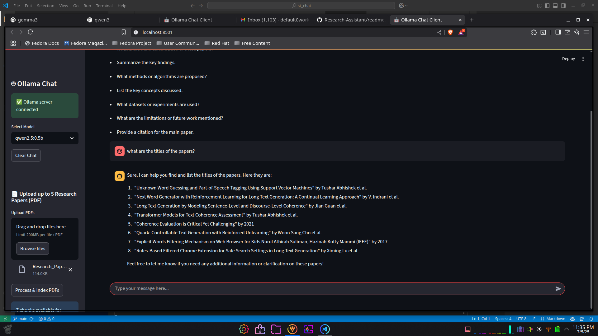

# Personal Research Assistant (RAG) - Local Setup Guide

## Submission Checklist
- [ ] Process Flow Chart, Design Document
- [ ] Python Scripts (Preferably VS Code)
- [ ] Project report with points from Step 5

---

This guide explains how to set up and run the Personal Research Assistant bot locally on your machine. The assistant enables offline research Q&A over uploaded PDFs using local language models and vector search.

---

## Demonstration
Below is a screenshot of the app in action:

<p align="center">
  
</p>

---

## Prerequisites
- **Python 3.8+**
- **pip** (Python package manager)
- **Ollama** (for local LLMs)
- **Streamlit**
- **FAISS**
- **PyMuPDF**
- **sentence-transformers**

---

## 1. Clone the Repository
```bash
git clone https://github.com/sayan-does/Research-Assistant

cd st_chat
```

## 2. Install Python Dependencies
It is recommended to use a virtual environment:
```bash
python3 -m venv .venv
source .venv/bin/activate
pip install --upgrade pip
pip install -r requirements.txt
```

## 3. Install and Start Ollama
- Download and install Ollama from [https://ollama.com/](https://ollama.com/)
- Start the Ollama server:
```bash
ollama serve
```
- Pull your desired models (e.g., Qwen, Gemma, TinyLlama):
```bash
ollama pull qwen2.5:0.5b
ollama pull qwen3:0.6b
ollama pull gemma3:1b
ollama pull tinyllama:1.1b
```

## 4. Run the Streamlit App
```bash
streamlit run app.py
```
- Open the provided local URL in your browser.
- Upload up to 5 research papers (PDFs) via the sidebar.
- Ask questions and review answers in the chat interface.

## 5. Model Evaluation (Optional)
To benchmark different models:
```bash
python eval_models.py
```
- Results are saved in `model_eval_results.json` and summarized in `model_comparison.md`.

---

## Notes
- All processing is local; no data leaves your machine.
- You can switch models in the UI or via the evaluation script.
- For best results, ensure your system has enough RAM and disk space for embeddings and models.

---

## Troubleshooting
- **Ollama not found:** Ensure Ollama is installed and running (`ollama serve`).
- **Model not found:** Use `ollama pull <model>` to download required models.
- **PDF parsing errors:** Ensure PDFs are not encrypted or corrupted.
- **Dependency issues:** Reinstall requirements in a clean virtual environment.

---

## File Structure
- `app.py` - Streamlit UI and RAG pipeline
- `llm_utils.py` - Ollama client and prompt logic
- `rag_utils.py` - PDF parsing, chunking, embedding, FAISS DB
- `eval_models.py` - Model evaluation script
- `model_eval_results.json` - Evaluation results
- `report.md` - System report
- `model_comparison.md` - Model comparison report
- `requirements.txt` - Python dependencies

---
