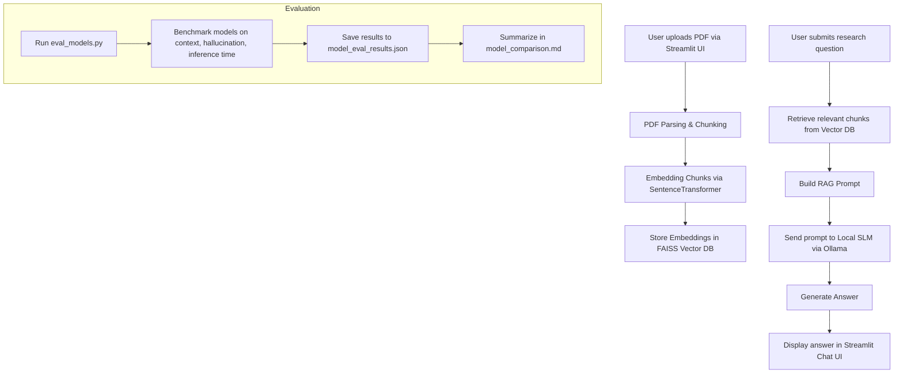

# Personal Research Assistant (RAG) - System Report

## Process Flow Chart

## Overview
This project implements a lightweight, offline-capable Personal Research Assistant using Retrieval-Augmented Generation (RAG). The assistant allows users to upload research papers (PDFs), which are parsed, chunked, and embedded into a local vector database. Users can then ask research questions, and the system retrieves relevant content and generates answers using a local small language model (SLM) via Ollama.

## Functional Flow
1. **PDF Upload:** Users upload up to 5 research papers via the Streamlit sidebar.
2. **Document Parsing & Chunking:** Each PDF is parsed and split into overlapping text chunks for better retrieval granularity.
3. **Embedding & Vector DB:** Chunks are embedded using a SentenceTransformer model and stored in a FAISS vector database (float32 for compatibility).
4. **RAG Pipeline:**
    - On user query, the system retrieves the most relevant chunks from the vector DB using vector search.
    - The retrieved context and user query are combined into a prompt using a generic, industry-standard system prompt.
    - The prompt is sent to a local SLM (e.g., gemma3:1b, qwen3:0.6b, etc.) via Ollama for answer generation.
5. **Chat Interface:** The Streamlit app provides a ChatGPT-like interface, displays example research questions, and streams the LLM's response.

## Key Features
- **Offline/Private:** All processing is local; no cloud APIs are used.
- **Multi-PDF Support:** Users can upload and query multiple papers at once.
- **RAG for Accuracy:** Answers are grounded in retrieved context, reducing hallucinations.
- **Model Flexibility:** Easily switch between different SLMs via Ollama.
- **Evaluation Suite:** Includes a script to benchmark models on context relevance, hallucination, and inference time.

## Technologies Used
- **Streamlit:** UI and chat interface
- **PyMuPDF:** PDF parsing
- **sentence-transformers:** Embedding model
- **FAISS:** Vector database
- **Ollama:** Local LLM serving

## Usage
1. Start Ollama and ensure your desired models are available.
2. Run the Streamlit app: `streamlit run app.py`
3. Upload PDFs, ask questions, and review answers.
4. Use `eval_models.py` to benchmark different models on your data.

## Limitations & Future Work
- Small models may hallucinate or miss context for complex queries.
- Only basic hallucination detection is implemented.
- Future: Add citation extraction, better chunking, and advanced evaluation metrics.
